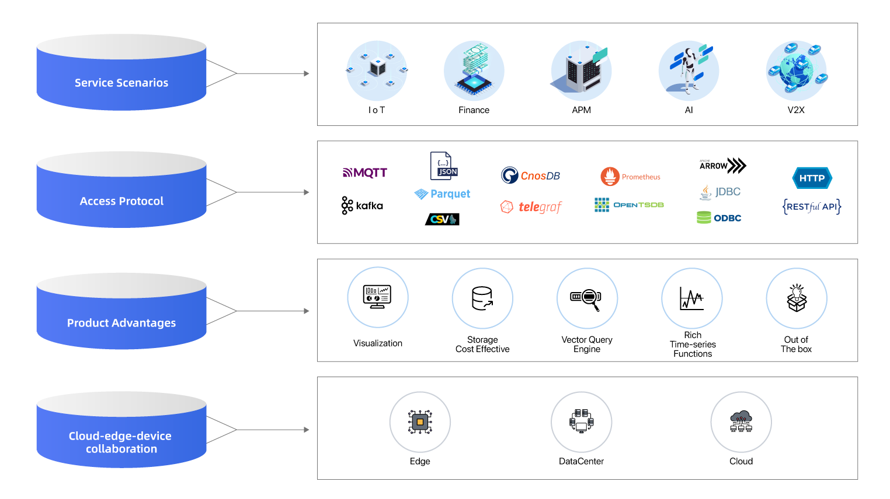

<div align="center">
  
</div>

<p align="center">
  <a href="https://github.com/cnosdb/cnosdb/actions">
  
  </a>

  <a href="https://www.rust-lang.org/">
  
  </a>

  <a href="https://github.com/cnoshb/cnosdb/blob/main/LICENSE.md">
  
  </a>

  <a href="https://twitter.com/CnosDB">
  
  </a>

  <a href="https://www.linkedin.com/company/cnosdb">
  
  </a>
</p>

<h3 align="center">
    <a href="https://www.cnosdb.com/">Website</a>
    •
    <a href="https://docs.cnosdb.com/zh/">Documentation</a>
    •
    <a href="https://docs.cnosdb.com/zh/guide/quick_start.html">Quick Start</a>
    •
    <a href="https://github.com/cnosdb/cnosdb/issues/1414">Eco-Integration</a>
</h3>

[English](./README.md) | 简体中文

CnosDB 是一款高性能、高压缩率、高易用性的开源分布式时序数据库。主要应用场景为物联网，工业互联网，车联网，IT运维等。所有代码均已在GitHub开源。

我们在设计上充分利用了时序数据特点，包括结构化数据、无事务、较少的删除更新、写多读少等等，因此相比其它时序数据库，CnosDB 有以下特点：

  - **高性能**：CnosDB 解决了时间序列膨胀，理论上支持时间序列无上限，支持沿时间线的聚合查询，包括按等间隔划分窗口的查询、按某列枚举值划分窗口的查询、按相邻时序记录的时间间隔长度划分窗口。具备对最新数据的缓存能力，并且可以配置缓存空间，能够高速获取最新数据。
  - **简单易用**：CnosDB 提供清晰明了的接口，简单的配置项目，支持标准SQL，轻松上手，与第三方工具生态无缝集成，拥有便捷的数据访问功能。支持 schemaless （"无模式"）的写入方式，支持历史数据补录（含乱序写入）。
  - **云原生**： CnosDB 有原生的分布式设计、数据分片和分区、存算分离、Quorum 机制、Kubernetes 部署和完整的可观测性，具有最终一致性，能够部署在公有云、私有云和混合云上。提供多租户的功能，有基于角色的权限控制。支持计算层无状态增减节点，储存层水平扩展提高系统存储容量。

# 整体架构 



# 快速开始

## 源码安装

### **支持平台**

我们支持以下平台，如果发现可以在列表以外的平台上运行，
请[报告](https://github.com/cnosdb/cnosdb/issues)给我们。

- Linux x86(`x86_64-unknown-linux-gnu`)
- Darwin arm(`aarch64-apple-darwin`)

### **编译环境**

1. 安装`Rust`，可前往[官网](https://www.rust-lang.org/learn/get-started)下载安装
2. 安装Cmake
```shell
# Debian or Ubuntu
apt-get install cmake
# Arch Linux
pacman -S cmake
# CentOS
yum install cmake
# Fedora
dnf install cmake
# macOS
brew install cmake
```

3. 安装FlatBuffers

```shell
# Arch Linux
pacman -S flatbuffers
# Fedora
dnf install flatbuffers
# Ubuntu
snap install flatbuffers
# macOS
brew install flatbuffers
```

如果您的系统不在此列，可按照如下方法安装FlatBuffers

```shell
$ git clone -b v22.9.29 --depth 1 https://github.com/google/flatbuffers.git && cd flatbuffers

# 根据操作系统选择以下命令之一
$ cmake -G "Unix Makefiles" -DCMAKE_BUILD_TYPE=Release
$ cmake -G "Visual Studio 10" -DCMAKE_BUILD_TYPE=Release
$ cmake -G "Xcode" -DCMAKE_BUILD_TYPE=Release

$ sudo make install
```

4. 安装Protobuf

```shell
# Arch Linux
pacman -S protobuf
# Fedora
dnf install protobuf
# Ubuntu
snap install protobuf
# macOS
brew install protobuf
```

### **编译**

```shell
git clone https://github.com/cnosdb/cnosdb.git && cd cnosdb
make build
```

### **运行**

#### 运行CnosDB

以下为单节点启动，如需启动集群，请参考 [部署](https://docs.cnosdb.com/docs/deploy/) 章节。

```bash
./target/debug/cnosdb run -M singleton --config ./config/config.toml
```

#### **运行CLI**
```shell
cargo run --package client --bin cnosdb-cli
```

## Docker安装

1. 安装 [Docker](https://www.docker.com/products/docker-desktop/)

2. 使用 Docker 启动容器
```shell
docker run --name cnosdb -d cnosdb/cnosdb:community-latest cnosdb run -M singleton --config /etc/cnosdb/cnosdb.conf
```
3. 进入容器
```shell
docker exec -it cnosdb bash
```
4. 运行`cnosdb-cli`
```shell
cnosdb-cli
```

> 退出请输入`\q`
> 查看帮助请输入`\?`
> 更多内容请查看[快速开始](https://docs.cnosdb.com/zh/latest/start/quick_start.html)

## 数据写入

- [SQL写入](https://docs.cnosdb.com/zh/latest/reference/sql.html#insert)
- [influxdb行协议](https://docs.influxdata.com/influxdb/v2.6/reference/syntax/line-protocol/)
- [批量导入](https://docs.cnosdb.com/zh/latest/develop/write.html#load-data)
- [telegraf](https://docs.cnosdb.com/eco-integration/telegraf)

下面将展示使用cli进行SQL写入的例子

1. 创建表

```sql
CREATE TABLE air (
    visibility DOUBLE,
    temperature DOUBLE,
    pressure DOUBLE,
    TAGS(station)
);
```

```bash
public ❯ CREATE TABLE air (
    visibility DOUBLE,
    temperature DOUBLE,
    pressure DOUBLE,
    TAGS(station)
);
Query took 0.063 seconds.
```

2. 插入一条数据

```sql
INSERT INTO air (TIME, station, visibility, temperature, pressure) VALUES
                (1673591597000000000, 'XiaoMaiDao', 56, 69, 77);
```

```bash
public ❯ INSERT INTO air (TIME, station, visibility, temperature, pressure) VALUES
                (1673591597000000000, 'XiaoMaiDao', 56, 69, 77);
+------+
| rows |
+------+
| 1    |
+------+
Query took 0.032 seconds.
```

3. 插入多条数据

```sql
INSERT INTO air (TIME, station, visibility, temperature, pressure) VALUES
                ('2023-01-11 06:40:00', 'XiaoMaiDao', 55, 68, 76),
                ('2023-01-11 07:40:00', 'DaMaiDao', 65, 68, 76);
```

```bash
public ❯ INSERT INTO air (TIME, station, visibility, temperature, pressure) VALUES
                ('2023-01-11 06:40:00', 'XiaoMaiDao', 55, 68, 76),
                ('2023-01-11 07:40:00', 'DaMaiDao', 65, 68, 76);
+------+
| rows |
+------+
| 2    |
+------+
Query took 0.038 seconds.
```

## 数据查询

- [SQL](https://docs.cnosdb.com/zh/latest/reference/sql.html)，兼容SQL标准
- [Prometheus remote read](https://docs.cnosdb.com/eco-integration/prometheus#remote-read)

下面将展示使用cli进行SQL查询的例子

```sql
-- 查询表数据
SELECT * FROM air;
```

```bash
public ❯ -- 查询表数据
SELECT * FROM air;
+---------------------+------------+------------+-------------+----------+
| time                | station    | visibility | temperature | pressure |
+---------------------+------------+------------+-------------+----------+
| 2023-01-11T06:40:00 | XiaoMaiDao | 55         | 68          | 76       |
| 2023-01-13T06:33:17 | XiaoMaiDao | 56         | 69          | 77       |
| 2023-01-11T07:40:00 | DaMaiDao   | 65         | 68          | 76       |
+---------------------+------------+------------+-------------+----------+
Query took 0.036 seconds.
```

# 连接器

CnosDB支持多种客户端的连接：

- C/C++
- Go
- Java
- Rust
- Python
- JDBC
- ODBC
- Arrow Flight SQL

以上示例请访问文档中的 [Connector](https://docs.cnosdb.com/zh/latest/reference/connector/) 章节。

# 路线图

- [路线图](./docs/roadmap/ROADMAP_CN.md)

# 加入社区

## 加入社区群

欢迎所有热爱时序数据库的开发者/用户参与到CnosDB User Group中。扫描下方二维码，加CC为好友，即可入群。

入群前请查看[入群须知](https://github.com/cnoshb/cnosdb/blob/main/docs/guidelines/CnosDBWeChatUserGroupGuidelines.md)


## 社区贡献指南

请参照[贡献指南](https://github.com/cnoshb/cnosdb/blob/main/CONTRIBUTING.md)成为CnosDB的Contributor。

# 致谢

- CnosDB 2.0使用[Apache Arrow](https://github.com/apache/arrow)作为内存模型。
- CnosDB 2.0的查询引擎基于[Apache Arrow DataFusion](https://github.com/apache/arrow-datafusion)构建。
- CnosDB 2.0的Bug挖掘工具使用[SQLancer](https://github.com/sqlancer/sqlancer)作为支持。
- CnosDB 2.0的集成测试框架基于[sqllogictest-rs](https://github.com/risinglightdb/sqllogictest-rs)构建。
- CnosDB 2.0 结合 [LangChain](https://github.com/hwchase17/langchain) 实现自然语言与数据库的交流。

